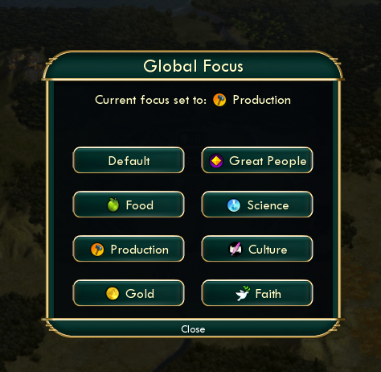
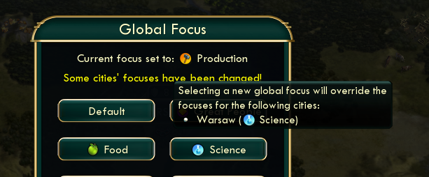

# Civilization V - Global Focus Mod

This mod adds a new "global focus" menu to the game, which lets you set (or unset) the focus for all your cities at once.

## Mod Behavior

The menu is accessed via the "Additional Information" dropdown in the top-right of the screen. Selecting a new focus will update the current focus in all your non-puppet cities and close the menu. Closing the menu via the close button, or by pressing escape, will not change any city focuses.

A selected global focus will also apply to new cities you settle, as well as cities you annex immediately after acquiring.

The only cities that cannot have their focus changed are puppeted cities, as they are forced to remain on gold focus until they are annexed. Once a puppeted city is annexed, its focus may be changed. *Annexing a city does not change its focus away from gold until you do so manually, or by setting a new global focus.* Therefore it is still necessary to change focus after each annexation.

You can still change cities' individual focuses manually. If you do so, the Global Focus menu will warn you that selecting a new global focus will override your manual selections, and it will list the cities and their current focuses.

## Download/Installation

First, navigate to the [Releases](https://github.com/spencerjbeckwith/Civ5-GlobalFocusMod/releases) page and download the `.zip` file of the latest version.

Extract the folder within this `.zip` so it lands in your `MODS` directory and the game will detect it automatically. On Windows, this is under `My Documents\My Games\Sid Meier's Civilization V\MODS`. On Linux (playing with Steam compatibility) this directory is under your Wine/Proton prefix, which will look something like `~/.steam/steam/steamapps/compatdata/8930/pfx/drive_c/users/steamuser/Documents/My Games/Sid Meier's Civilization 5/MODS/`. 8930 is the ID for Civ 5.

## Development

This mod was not developed in ModBuddy. Thankfully there is very little that ModBuddy does that can't be done in a regular repository... except upload to the Steam workshop, unfortunately.

To "build" the mod, run `make build`. This will build your `.modinfo` file (including the mod's version and MD5 hashes of source files). It will also move the mod source files into the `output` directory, which can be dropped directly into your Civ 5 `MODS` folder.

To install the built mod, run `make install`. In order for this to work properly, you will want to configure `MODS_PATH` at the top of the Makefile to point to `MODS`.

This was development environment was created on Ubuntu and has not been tested on Windows.

## TODO

- Support multiple human players (no conditional checks on `player:IsHuman()`)
- Is there some way we can update a puppet's focus when it is annexed?

## References

- [Lua and UI reference](https://modiki.civfanatics.com/index.php?title=Lua_and_UI_Reference_(Civ5))
- [Very useful UI guide](https://forums.civfanatics.com/threads/user-interface-components.461552/)
